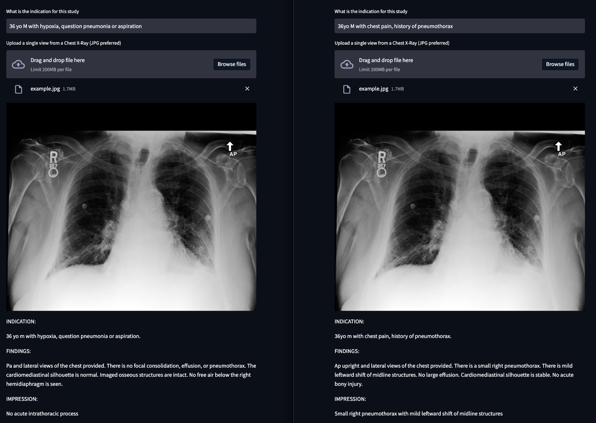

# Pre-reading radiology reporst


## Data
All data were derived from MIMIC and require signing a data use agreement with Physionet.  None are provided here.

## Services

This repository exposes four components that are useful in a data science proof of concept.
- A container running Jupyter notebooks with common machine learning libraries (available @ localhost:8888).  Any notebooks will persist in a mounted volume (./volumes/notebooks)
- A container running Streamlit allows a user to access the predictions from the model based on user inputs (available at localhost:8501)

## Usage

turn on the application 
```
docker-compose up 
```

download the data from physionet, passing any argument downloads the data (no arguments does nothing)
```
docker-compose run physionet True 
```

run the etl migrations
```
docker-compose run etl 
```

train the model
```
docker-compose run train
```

## Structure

```
|-- containers - code
|   |-- etl         # transforms raw data from physionet into jsonlines files
|   |-- jupyter     # interactive notebooks
|   |-- physionet   # download the MIMIC-CXR and MIMIC-CXR-JPG data from physionet
|   |-- prerad      # a small streamlit application to demo the model functionality 
|-- volumes         # persistent data
|   |-- notebooks   # jupyter notebooks persisted here
|   |-- physionet   # physionet data is persisted here
```

## Streamlit User Interface

  

A small web application can take a clinical indication and a chest x-ray, returns a reasonably templated radiology report.
