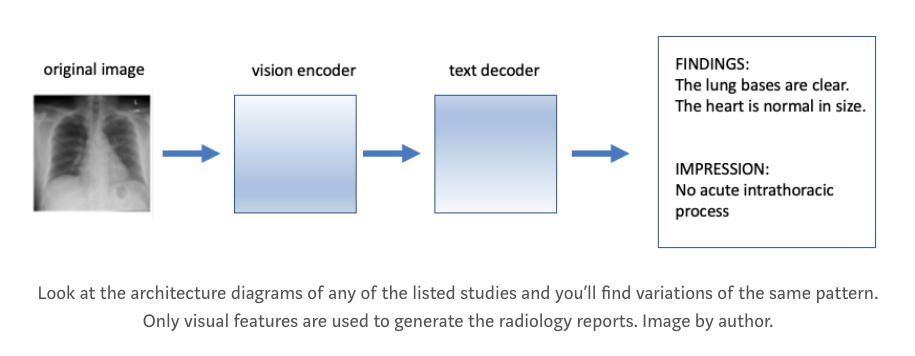

# A new generative model for radiology

tl;dr you should include text inputs along with images

[](https://github.com/nathansutton/prerad/actions)

Available @ https://nathansutton-prerad.hf.space

Machine learning in radiology has come a long way. For a long time the goal was simply to make a probability estimate of different conditions available to the radiologist at the time of interpretation. As evidence, see any of the hundreds of AI vendors that have commercialized computer vision algorithms. On the academic frontier, recent advances have made it possible to generate realistic sounding radiology reports directly from an image. The first paper I found describing such a model was from 2017, but there have been many more recently with the onset of transformers.

However, every example architecture I have found suffers from the same structural problem.

__They aren't answering a clinical question.__

When a provider orders an imaging study the ordering provider is asking the radiologist to combine their education and experience to answer a clinical question. Unlike most specialist consultations, the format is asynchronous. Occasional telephone or face-to-face consults do occur for time-sensitive findings, but this is not the norm. Instead, the radiology report is the primary product of this provider-radiologist specialist consultation. This document's purpose to answer the clinical question, or indication. It usually has a succinct 'impression' section at the end. For example…

```
INDICATION: 36yo M with hypoxia // ?pna, aspiration.

FINDINGS: 

PA and lateral views of the chest provided. The lungs are adequately aerated. 
There is a focal consolidation at the left lung base adjacent to the lateral 
hemidiaphragm. There is mild vascular engorgement. There is bilateral apical 
pleural thickening. The cardiomediastinal silhouette is remarkable for 
arch calcifications. The heart is top normal in size.

IMPRESSION: 

Focal consolidation at the left lung base, possibly representing aspiration 
or pneumonia. Central vascular engorgement.
```

__Incorrect Architectures__  
Medical images alone are not sufficient to answer why an imaging study was ordered by a provider. For example, a provider might order a chest x-ray because their patient is presenting with shortness of breath and they suspect pneumonia. In another case, they might suspect a fracture after a motor vehicle collision and order a chest x-ray to rule out a broken rib. The same image could answer either of these clinical questions.
In my search I found over ten studies since 2017 describing model architectures that could conditionally generate entire radiology reports from an image (Jing et al. 2017, Li et al. 2018, Xue et al. 2018, Singh et al. 2019, Yuan et al. 2019, Chen et al. 2020, Miura et al. 2020, Fenglin et al. 2021, Nooralahzadeh et al. 2021, Sirshar et al. 2022, Chen et al. 2022, Yang et al. 2022). Unfortunately, none had text inputs. The one exception was a recent paper included the full-text radiology report as a textual input alongside the image, but its goal was to remove hallucinated references by cleaning up the data used for model training (Ramesh et al. 2022). These oversights are a problem because all the variation in the generated reports will come from the images. They cannot answer a clinical question posed in text by the ordering provider.



__Better Architectures__  
To realistically describe what a radiologist is doing when they write a report a deep learning model needs to accept the same inputs. This means the conditional generation of radiology reports should include both image and text inputs and have a text output. This year a new transformer architecture particularly suited for this type of multi-modal problem was just released by SalesForce (Li et al. 2022). BLIP has a dual text and vision encoder paired with a text decoder. This allows it to continue generating new text for a radiology report from a given prompt's starting point. Lucky for us, the first paragraph of most radiology reports is the clinical question!
This makes conditionally generating a radiology report possible in couple of lines of code.

```
from PIL import Image
from transformers import BlipForConditionalGeneration, BlipProcessor

# read in the model
processor = BlipProcessor.from_pretrained("nathansutton/generate-cxr")
model = BlipForConditionalGeneration.from_pretrained("nathansutton/generate-cxr")

# your data
my_image = 'my-chest-x-ray.jpg'
my_indication = 'RLL crackles, eval for pneumonia'

# process the inputs
inputs = processor(
    images=Image.open(my_image), 
    text='indication:' + my_indication,
    return_tensors="pt"
)

# generate an entire radiology report
output = model.generate(**inputs,max_length=512)
report = processor.decode(output[0], skip_special_tokens=True)
```

__Simplified Application__  
Starting from the base BLIP image captioning model, I fine-tuned a causal language model to generate radiology reports from a chest x-ray and a clinical prompt. The data used to fine-tune these assessments were derived from the MIMIC critical care database. Specifically, I cross referenced the original radiology reports in the MIMIC-CXR project with the JPG images available in the MIMIC-CXR-JPG project.
More information on how to reproduce these labels can be found in the corresponding Github repository.

Does it work? Let's go back to our original radiology report and perturb it with two different clinical indications. On the left we show the original question for this image ('question pneumonia') and on the right a fictitious concern ('question pneumothorax'). The original reference report is in quotes above. You can play around with your own de-identified images in this interactive web application hosted graciously by huggingface spaces.

  

The same image with two different clinical prompts. This shows that by changing the prompt to 'chest pain, history of pneumothorax' the model successfully changed its answer in response to a different clinical question.This is a simplified example was meant to demonstrate one concept. Conditionally generated radiology reports should include text inputs alongside the medical images to answer a clinical question. Obviously this kind of automation is not intended to replace radiologists, but it could help them quickly template their reports so they aren't starting from scratch.

In the bigger scheme of things, I have seen this kind of disparity between the question technologists are answering and providers are asking repeated across healthcare. Bring a provider on board to collaborate, and you'll be rewarded with actually useful models.

## Data
All data were derived from MIMIC and require signing a data use agreement with Physionet.  None are provided here.

## Services

This repository exposes four components that are useful in a data science proof of concept.
- A container running Jupyter notebooks with common machine learning libraries (available @ localhost:8888).  Any notebooks will persist in a mounted volume (./volumes/notebooks)
- A container running Streamlit allows a user to access the predictions from the model based on user inputs (available at localhost:8501)

## Usage

turn on the application 
```
docker-compose up 
```

download the data from physionet, passing any argument downloads the data (no arguments does nothing)
```
docker-compose run physionet True 
```

run the etl migrations
```
docker-compose run etl 
```

train the model
```
docker-compose run train
```

## Structure

```
|-- containers - code
|   |-- etl         # transforms raw data from physionet into jsonlines files
|   |-- jupyter     # interactive notebooks
|   |-- physionet   # download the MIMIC-CXR and MIMIC-CXR-JPG data from physionet
|   |-- streamlit   # a small streamlit application to demo the model functionality 
|-- volumes         # persistent data
|   |-- notebooks   # jupyter notebooks persisted here
|   |-- physionet   # physionet data is persisted here
```

## References

- Chen, Zhihong, et al. "Generating radiology reports via memory-driven transformer." arXiv preprint arXiv:2010.16056 (2020).  
- Chen, Zhihong, et al. "Cross-modal memory networks for radiology report generation." arXiv preprint arXiv:2204.13258 (2022).  
- Jing, Baoyu, Pengtao Xie, and Eric Xing. "On the automatic generation of medical imaging reports." arXiv preprint arXiv:1711.08195 (2017).  
- Li, Junnan, et al. "Blip: Bootstrapping language-image pre-training for unified vision-language understanding and generation." International Conference on Machine Learning. PMLR, 2022.  
- Li, Yuan, et al. "Hybrid retrieval-generation reinforced agent for medical image report generation." Advances in neural information processing systems 31 (2018).  
- Liu, Fenglin, et al. "Exploring and distilling posterior and prior knowledge for radiology report generation." Proceedings of the IEEE/CVF conference on computer vision and pattern recognition. 2021.  
- Miura, Yasuhide, et al. "Improving factual completeness and consistency of image-to-text radiology report generation." arXiv preprint arXiv:2010.10042 (2020).  
- Nooralahzadeh, Farhad, et al. "Progressive transformer-based generation of radiology reports." arXiv preprint arXiv:2102.09777 (2021).  
- Ramesh, Vignav, Nathan A. Chi, and Pranav Rajpurkar. "Improving Radiology Report Generation Systems by Removing Hallucinated References to Non-existent Priors." Machine Learning for Health. PMLR, 2022.   
- Sirshar, Mehreen, et al. "Attention based automated radiology report generation using CNN and LSTM." Plos one 17.1 (2022): e0262209.  
- Singh, Sonit, et al. "From chest x-rays to radiology reports: a multimodal machine learning approach." 2019 Digital Image Computing: Techniques and Applications (DICTA). IEEE, 2019.  
- Yang, Shuxin, et al. "Knowledge matters: Chest radiology report generation with general and specific knowledge." Medical Image Analysis 80 (2022): 102510.  
- Xue, Yuan, et al. "Multimodal recurrent model with attention for automated radiology report generation." Medical Image Computing and Computer Assisted Intervention–MICCAI 2018: 21st International Conference, Granada, Spain, September 16–20, 2018, Proceedings, Part I. Springer International Publishing, 2018.  
- Yuan, Jianbo, et al. "Automatic radiology report generation based on multi-view image fusion and medical concept enrichment." Medical Image Computing and Computer Assisted Intervention–MICCAI 2019: 22nd International Conference, Shenzhen, China, October 13–17, 2019, Proceedings, Part VI 22. Springer International Publishing, 2019.  